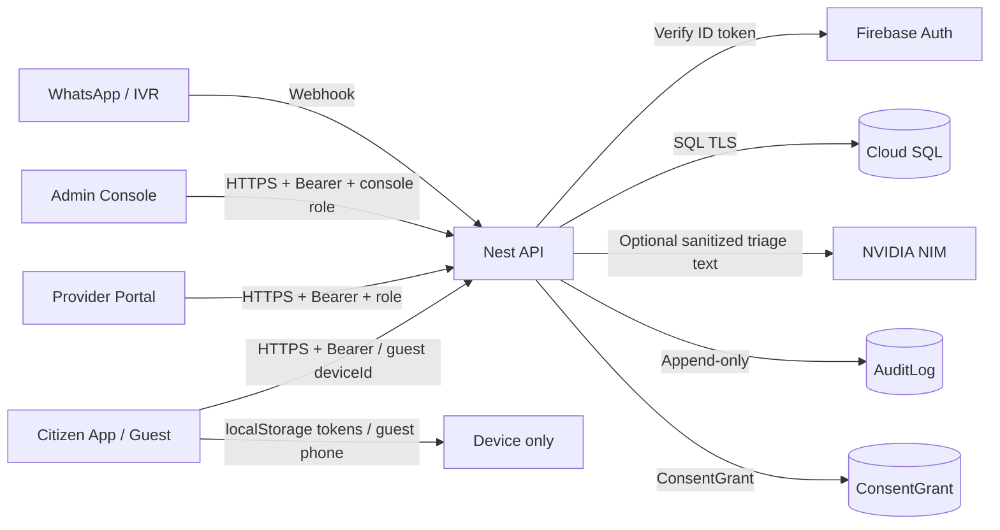

# DATA_FLOW.md — Rakshak / Sahayak Platform

**Date:** 2026-07-26  
**Owner:** Chief Privacy Officer / Legal Compliance Architect  
**Regulatory primary:** Digital Personal Data Protection Act, 2023 (India)  
**Related:** `DATA_INVENTORY.md`, `PRIVACY_COMPLIANCE_REPORT.md`

---

## 1. Purpose

Describe what personal data the platform collects, why, where it is stored, who can access it, how long it is retained, how it is protected, and how it is deleted or anonymized.

---

## 2. Systems in scope

| Surface | Role |
|---|---|
| Citizen App (Next.js) | Emergency triage, bed search, case tracking, consent & rights UI |
| Provider Portal | Hospital / fleet / pharmacy / blood operations |
| Admin Console | Support, onboarding, config, AI ops review |
| Nest API | Auth, cases, resource coordination, privacy APIs |
| Cloud SQL (Postgres) | Authoritative store (multi-schema) |
| Memorystore Redis | Short-lived operational cache / rate helpers |
| Firebase Auth | Phone OTP + email identity (tokens verified server-side) |
| NVIDIA NIM (optional) | Triage severity classification |
| WhatsApp / IVR (Twilio/Meta/Exotel) | Messaging entry channels |
| Cloud Storage / Secret Manager | Secrets and future document objects |

---

## 3. Data flows (summary)

---

## 4. Collection catalogue

### 4.1 Authentication & identity

| Data | Why | Where stored | Access | Retention | Encryption | Deletion |
|---|---|---|---|---|---|---|
| Mobile number (E.164) | OTP login identity | Firebase Auth; not duplicated as case.location phone | User + Auth service | While account active | In transit TLS; at rest via Firebase/GCP | Account erasure + Firebase disable (ops) |
| Email (staff/admin) | Console login | Firebase + `ConsoleUser.email` | Admin roles | Employment + policy | TLS + Cloud SQL | Soft deactivate / admin process |
| Firebase UID | Session principal | API JWT/session claims; case `initiatorId` | Backend services | Account lifetime | TLS + Cloud SQL | Pseudonymized on erasure (`erased:…`) |
| ID / refresh tokens | Session continuity | Browser `localStorage` (citizen/provider/admin) | Device owner | Browser session / until logout | Transit TLS only on device | Logout / clear storage / erasure clears client |

**Minimization:** Guest emergency path does **not** require account creation. Guest phone is kept on-device unless messaging channel derives a hashed `contactRef`.

### 4.2 Emergency / health triage

| Data | Why | Where stored | Access | Retention | Encryption | Deletion |
|---|---|---|---|---|---|---|
| Consciousness / breathing / bleeding flags | Severity + dispatch | Case timeline payload; AI input (sanitized) | Assigned providers, coordinators, audit | Medical/ops retention; location coarsened per policy | TLS + Cloud SQL | Case location anonymized on erasure; timeline retained redacted (GT-02) |
| Case severity | Routing priority | `Case.severity` | Same | Case lifetime | TLS + Cloud SQL | Retained for safety analytics (non-identifying) |
| Free-text triage (if any) | AI assist | Sanitized before NIM | AI provider + logs (masked) | AI metadata 30d default | TLS | Not persisted raw to LLM logs by design |

### 4.3 Location

| Data | Why | Where stored | Access | Retention | Encryption | Deletion |
|---|---|---|---|---|---|---|
| Lat/lng + address | Ambulance pickup / nearby beds | `Case.location` JSON; ambulance pickup fields | Drivers on offer, hospital intake, coordinators | Precise: **90 days** after CLOSED/CANCELLED (configurable `retention.locationPreciseDays`) then coarsened | TLS + Cloud SQL | Erasure redacts location; retention job coarsens |

### 4.4 Consent & notices

| Data | Why | Where stored | Access | Retention | Encryption | Deletion |
|---|---|---|---|---|---|---|
| Privacy Policy / Terms acceptance | DPDP notice + contract | `ConsentGrant` + version in `scope` | Subject + compliance | Indefinite for proof of consent history | TLS + Cloud SQL | Revoke sets `revokedAt`; history kept |
| Emergency processing consent | Legitimate emergency use transparency | `ConsentGrant` purpose `EMERGENCY_PROCESSING:v1` | Subject | Same | TLS + Cloud SQL | Withdraw via DELETE `/v1/privacy/consents/:id` |
| Policy versions | Version tracking | `PRIVACY_POLICY_VERSION` / `TERMS_VERSION` + grant scope | Public notices endpoint | N/A | N/A | Bump versions on policy change |

### 4.5 Operational provider data

| Data | Why | Where stored | Access | Retention | Encryption | Deletion |
|---|---|---|---|---|---|---|
| Bed counts, fleet status, pharmacy stock | Resource coordination | Module schemas | Org-scoped staff | Operational | TLS + Cloud SQL | Org offboarding |
| Driver lastLat/lastLng | Offer matching | `AmbulanceDriver` | Operator + dispatch | While on duty + short history | TLS + Cloud SQL | Off-duty / purge job (future) |
| Support ticket body | Helpdesk | `SupportTicket` | Support agents | **365 days** default after resolve | TLS + Cloud SQL | Ticket retention job (config) |

### 4.6 AI

| Data | Why | Where stored | Access | Retention | Encryption | Deletion |
|---|---|---|---|---|---|---|
| Sanitized triage snippet | Severity classification | Transient request to NIM; metadata event | AI platform | Prompt metadata **30 days** | TLS to provider | No long-term prompt store in app DB |
| AI ops suggestions | Admin assist | `AiOpsSuggestion` | Console admins | Until dismissed + policy | TLS + Cloud SQL | Admin dismiss |

**Controls:** `sanitizeForAi()` strips phones, emails, and obvious name patterns before LLM calls. Fallback classifiers run locally if NIM unavailable.

### 4.7 Logging & audit

| Data | Why | Where stored | Access | Retention | Encryption | Deletion |
|---|---|---|---|---|---|---|
| Audit actions (login, export, erasure, config, …) | Accountability | `AuditLog` **append-only** (Prisma middleware blocks update/delete) | Compliance / admin | ≥ **180 days** application logs (CERT-In aligned default) | TLS + Cloud SQL | No delete via app; archival TBD |
| Application logs | Ops / incident | Cloud Logging | Platform eng | 180d default | GCP | GCP sink retention |

**Masking:** Phones, Bearer tokens, and free-text bodies are masked in messaging adapters (`maskPhone` / `maskLogText`).

---

## 5. Cross-border / third parties

| Party | Data shared | Legal note |
|---|---|---|
| Firebase (Google) | Phone/email auth | Processor; India project preferred (`asia-south1` stack) |
| GCP Cloud SQL / Run | All app data | India region `asia-south1` |
| NVIDIA NIM | Sanitized triage text only | Cross-border risk if endpoint outside India — document SCC/transfer basis before prod scale; local fallback available |
| Meta / Twilio / Exotel | Phone + message body for channel replies | Contractual DPA; minimize payload |

---

## 6. Data principal rights (implemented)

| Right | Mechanism |
|---|---|
| Notice | `GET /v1/privacy/notices` + guest/triage/OTP copy |
| Access / view | `GET /v1/privacy/me` + Citizen **Your data rights** |
| Export / portability-ready | `GET /v1/privacy/export` → JSON download |
| Correct | Profile screens (client) + future profile API |
| Withdraw consent | `DELETE /v1/privacy/consents/:id` + Consent UI toggles |
| Erasure / deactivate | `POST /v1/privacy/erasure` `{ confirm: true }` |
| Grievance | `privacy@sahayak.in` (notice contact) |

---

## 7. Retention configuration

Stored in `PlatformConfig` group `retention` (seeded by `RetentionJob`):

| Key | Default |
|---|---|
| `locationPreciseDays` | 90 |
| `applicationLogDays` | 180 |
| `aiMetadataDays` | 30 |
| `guestDeviceDays` | 90 |
| `supportTicketDays` | 365 |

Admin read: `GET /v1/privacy/retention` (ADMIN role).

---

## 8. Deletion / anonymization path

1. Subject confirms erasure in Citizen app or API.  
2. Active consents revoked; `ACCOUNT_DEACTIVATED` grant recorded.  
3. Case `location` redacted; `primaryPatientId` pseudonymized when matching subject.  
4. Immutable timeline retained for care/legal continuity (GT-02) without unnecessary contact fields.  
5. Audit event `DATA_ERASURE_COMPLETED` appended.  
6. Client clears tokens and guest local keys.

---

## 9. GDPR extensibility

Architecture already separates: (a) consent purposes with versions, (b) export JSON, (c) erasure orchestration, (d) retention config. Future GDPR add-ons (DPIA templates, EU residency, DSR ticket workflow, lawful basis enum) can extend `ConsentGrant.purpose` / PrivacyService without schema rewrite.
